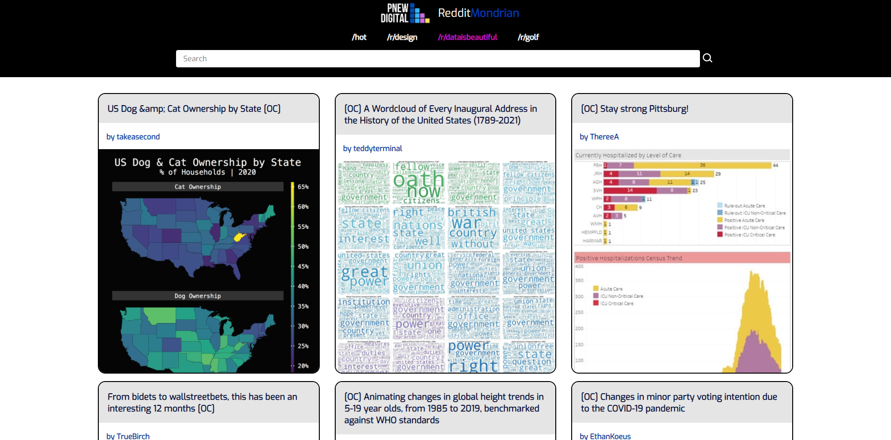

# The Reddit Mondrian App

> The Reddit Mondrian App connects to the Reddit API to provide hot posts for design, data & technology topics.

## Table of contents

* [General info](#general-info)
* [Screenshots](#screenshots)
* [Technologies](#technologies)
* [Setup](#setup)
* [Features](#features)
* [Status](#status)
* [Inspiration](#inspiration)
* [Contact](#contact)

## General info

The purpose of this project is to help me to better understand React, Redux, Jest, Enzyme, the Reddit API and to inspire people with valuable content.

## Screenshots



## Technologies

* JavaScript - version ES6
* React - version 17.0.1
* React-Redux - version 7.2.2
* Redux Toolkit - 1.5.0
* Jest - version 26.2

## Setup

Please use npm install & npm start to run the application in your local environmnet.

## Code Examples

Examples of API building blocks:

```javascript
import { API_URL } from '../../constants/base'

export const getSubredditPosts = async (subreddit) => {
  const response = await fetch(`${API_URL}${subreddit}.json?limit=60`)
  const json = await response.json()

  return json.data.children.map((post) => post.data)
}

export const getPostComments = async (permalink) => {
  const response = await fetch(`${API_URL}${permalink}.json`)
  const json = await response.json()

  return json[1].data.children.map((subreddit) => subreddit.data)
}

```

## Features

List of features ready and TODOs for future development

* Users can use the application on any device (desktop to mobile)
* Users can use the application on any modern browser
* Users see an initial view of the data when first visiting the app
* Users can search the data using terms
* Users can filter the data based on categories that are predefined
* Users are delighted with a cohesive design system
* Users are able to leave an error state

To-do list:

* Users can access the application at a URL
* Users are shown a detail view (modal or new page/route) when they select an item
* Users are delighted with animations and transitions

## Status

Project is: _wip_

## Inspiration

Thanks to REDDIT for providing this great API.

## Contact

Created by [@pwagnerde](https://www.linkedin.com/in/pwagnerde/) - feel free to contact me!
